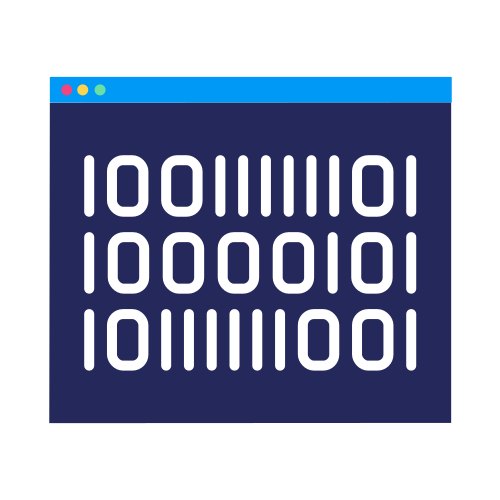

    

<h4>

A collection of fun personal projects and scripts.

</h4>
 

## [Mean Vs Median](./mean_vs_median/)
A simulation of what hanppens to the mean and median on a set of data when outliers are added. This animation can help us understand why sometimes the median is a better representation of certain datasets.

https://github.com/eliasbatistasouza/misc/assets/8121717/dccc3f58-3a34-4579-9d58-4e3c509dbcb5

## [Galton Board](./galton_board/)
A visual implementation of [Galton Board](https://en.wikipedia.org/wiki/Galton_board), a device used to demonstrate how a normal distribution can be formed through the occurence of mutiple random events.

